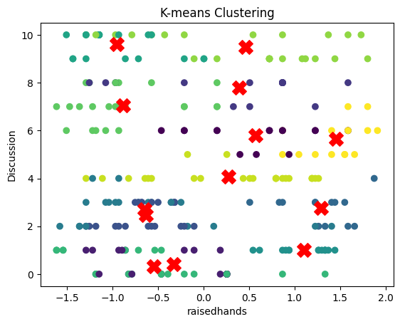
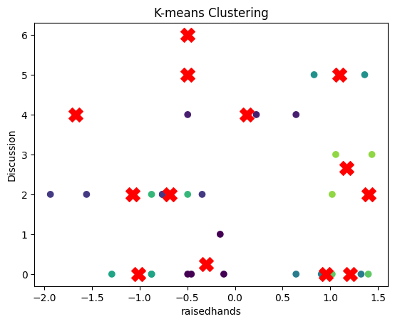

# With the dataset given , do an exploratory data analysis and k-means clustering.

## Access dataset


```python
import pandas as pd
import numpy as np
df = pd.read_csv("KMEANS_SAMPLE.csv")
df.sample(8)   #Pick 8 random rows to view
import matplotlib.pyplot as plt 
import seaborn as sns
```


```python
df.head()
```


<div>
<style scoped>
    .dataframe tbody tr th:only-of-type {
        vertical-align: middle;
    }

    .dataframe tbody tr th {
        vertical-align: top;
    }

    .dataframe thead th {
        text-align: right;
    }
</style>
<table border="1" class="dataframe">
  <thead>
    <tr style="text-align: right;">
      <th></th>
      <th>gender</th>
      <th>NationalITy</th>
      <th>PlaceofBirth</th>
      <th>StageID</th>
      <th>GradeID</th>
      <th>SectionID</th>
      <th>Topic</th>
      <th>Semester</th>
      <th>Relation</th>
      <th>raisedhands</th>
      <th>VisITedResources</th>
      <th>AnnouncementsView</th>
      <th>Discussion</th>
      <th>ParentAnsweringSurvey</th>
      <th>ParentschoolSatisfaction</th>
      <th>StudentAbsenceDays</th>
      <th>Class</th>
    </tr>
  </thead>
  <tbody>
    <tr>
      <th>0</th>
      <td>M</td>
      <td>KW</td>
      <td>KuwaIT</td>
      <td>lowerlevel</td>
      <td>G-04</td>
      <td>A</td>
      <td>IT</td>
      <td>F</td>
      <td>Father</td>
      <td>15</td>
      <td>16</td>
      <td>2</td>
      <td>20</td>
      <td>Yes</td>
      <td>Good</td>
      <td>Under-7</td>
      <td>M</td>
    </tr>
    <tr>
      <th>1</th>
      <td>M</td>
      <td>KW</td>
      <td>KuwaIT</td>
      <td>lowerlevel</td>
      <td>G-04</td>
      <td>A</td>
      <td>IT</td>
      <td>F</td>
      <td>Father</td>
      <td>20</td>
      <td>20</td>
      <td>3</td>
      <td>25</td>
      <td>Yes</td>
      <td>Good</td>
      <td>Under-7</td>
      <td>M</td>
    </tr>
    <tr>
      <th>2</th>
      <td>M</td>
      <td>KW</td>
      <td>KuwaIT</td>
      <td>lowerlevel</td>
      <td>G-04</td>
      <td>A</td>
      <td>IT</td>
      <td>F</td>
      <td>Father</td>
      <td>10</td>
      <td>7</td>
      <td>0</td>
      <td>30</td>
      <td>No</td>
      <td>Bad</td>
      <td>Above-7</td>
      <td>L</td>
    </tr>
    <tr>
      <th>3</th>
      <td>M</td>
      <td>KW</td>
      <td>KuwaIT</td>
      <td>lowerlevel</td>
      <td>G-04</td>
      <td>A</td>
      <td>IT</td>
      <td>F</td>
      <td>Father</td>
      <td>30</td>
      <td>25</td>
      <td>5</td>
      <td>35</td>
      <td>No</td>
      <td>Bad</td>
      <td>Above-7</td>
      <td>L</td>
    </tr>
    <tr>
      <th>4</th>
      <td>M</td>
      <td>KW</td>
      <td>KuwaIT</td>
      <td>lowerlevel</td>
      <td>G-04</td>
      <td>A</td>
      <td>IT</td>
      <td>F</td>
      <td>Father</td>
      <td>40</td>
      <td>50</td>
      <td>12</td>
      <td>50</td>
      <td>No</td>
      <td>Bad</td>
      <td>Above-7</td>
      <td>M</td>
    </tr>
  </tbody>
</table>
</div>


```python
round(df["GradeID"].value_counts(normalize=True)*100,2)
df['StageID'].unique()
```


    array(['lowerlevel', 'MiddleSchool', 'HighSchool'], dtype=object)


# Data analysis

## Lower level student behaviour


```python
df_lowerlevel = df[df['StageID'] == 'lowerlevel']
```


```python
df_lowerlevel.info()
```

    <class 'pandas.core.frame.DataFrame'>
    Index: 199 entries, 0 to 389
    Data columns (total 17 columns):
     #   Column                    Non-Null Count  Dtype 
    ---  ------                    --------------  ----- 
     0   gender                    199 non-null    object
     1   NationalITy               199 non-null    object
     2   PlaceofBirth              199 non-null    object
     3   StageID                   199 non-null    object
     4   GradeID                   199 non-null    object
     5   SectionID                 199 non-null    object
     6   Topic                     199 non-null    object
     7   Semester                  199 non-null    object
     8   Relation                  199 non-null    object
     9   raisedhands               199 non-null    int64 
     10  VisITedResources          199 non-null    int64 
     11  AnnouncementsView         199 non-null    int64 
     12  Discussion                199 non-null    int64 
     13  ParentAnsweringSurvey     199 non-null    object
     14  ParentschoolSatisfaction  199 non-null    object
     15  StudentAbsenceDays        199 non-null    object
     16  Class                     199 non-null    object
    dtypes: int64(4), object(13)
    memory usage: 28.0+ KB


## Gender distribution in Lower levels:a


```python

plt.subplot(1, 2, 1)
sns.countplot(x='gender', data=df_lowerlevel)
plt.title("Gender Distribution", fontsize=20, color='Brown', pad=20)

# Pie chart
plt.subplot(1, 2, 2)
df_lowerlevel['gender'].value_counts().plot.pie(explode=[0.1, 0.1], autopct='%1.2f%%', shadow=True)
plt.title("Gender Distribution", fontsize=20, color='Brown', pad=20)

plt.tight_layout()
plt.show()
```


    

    


## Parent Response Analysis


```python


plt.subplot(1,2,1)
sns.countplot(x='ParentAnsweringSurvey', data=df_lowerlevel)
plt.title("ParentAnsweringSurvey Distribution", fontsize=20, color='Brown', pad=20)


plt.subplot(1, 2, 2)
df_lowerlevel['ParentAnsweringSurvey'].value_counts().plot.pie(explode=[0.1, 0.1], autopct='%1.2f%%', shadow=True)
plt.title("ParentAnsweringSurvey", fontsize=20, color='Brown', pad=20)

plt.tight_layout()
plt.show()
```


    

    


## Student absence analysis


```python
plt.subplot(1, 2, 1)
sns.countplot(x='StudentAbsenceDays', data=df_lowerlevel)
plt.title("StudentAbsenceDays analysis", fontsize=20, color='Brown', pad=20)

# Pie chart
plt.subplot(1, 2, 2)
df_lowerlevel['StudentAbsenceDays'].value_counts().plot.pie(explode=[0.1, 0.1], autopct='%1.2f%%', shadow=True)
plt.title("StudentAbsenceDays", fontsize=20, color='Brown', pad=20)

plt.tight_layout()
plt.show()
```


    

    


## Parent satisfaction analysis using K-Means Clustering

# Encoding labels


```python
from sklearn.preprocessing import LabelEncoder
le = LabelEncoder()
df_lowerlevel['Topic'] = le.fit_transform(df_lowerlevel['Topic'])
```

    /home/u213916/tmp/ipykernel_2982528/2022701004.py:3: SettingWithCopyWarning: 
    A value is trying to be set on a copy of a slice from a DataFrame.
    Try using .loc[row_indexer,col_indexer] = value instead
    
    See the caveats in the documentation: https://pandas.pydata.org/pandas-docs/stable/user_guide/indexing.html#returning-a-view-versus-a-copy
      df_lowerlevel['Topic'] = le.fit_transform(df_lowerlevel['Topic'])


## Standardising and downscaling input values


```python
from sklearn.preprocessing import StandardScaler
input_col = ['raisedhands','Discussion']
df_scaled = df_lowerlevel
for col in input_col:
    sc = StandardScaler()#Scale down the data
    df_scaled[col] = sc.fit_transform(df_lowerlevel[[col]])
X=df_scaled[input_col+['Topic']].values
```

## Use GridSearch to find best parameter and score


```python
from sklearn.model_selection import GridSearchCV

param_grid = {'n_clusters': [5, 6, 7, 8, 9, 10, 13]}

# Create a KMeans object
kmeans = KMeans(n_init='auto',random_state=100)

# Create a GridSearchCV object
grid_search = GridSearchCV(kmeans, param_grid, cv=5)

# Perform grid search
grid_search.fit(X)

# Get the best parameters and the best score
best_params = grid_search.best_params_
best_score = grid_search.best_score_
print("Best params:{}\nBest score::{}".format(best_params,best_score))
```

    Best params:{'n_clusters': 13}
    Best score::-50.16593503668124


```python
kmeans = KMeans(n_clusters = 13,n_init='auto',random_state=100)#13 is best number of clusters
kmeans.fit(X)# Train the model
```


<style>#sk-container-id-2 {color: black;background-color: white;}#sk-container-id-2 pre{padding: 0;}#sk-container-id-2 div.sk-toggleable {background-color: white;}#sk-container-id-2 label.sk-toggleable__label {cursor: pointer;display: block;width: 100%;margin-bottom: 0;padding: 0.3em;box-sizing: border-box;text-align: center;}#sk-container-id-2 label.sk-toggleable__label-arrow:before {content: "▸";float: left;margin-right: 0.25em;color: #696969;}#sk-container-id-2 label.sk-toggleable__label-arrow:hover:before {color: black;}#sk-container-id-2 div.sk-estimator:hover label.sk-toggleable__label-arrow:before {color: black;}#sk-container-id-2 div.sk-toggleable__content {max-height: 0;max-width: 0;overflow: hidden;text-align: left;background-color: #f0f8ff;}#sk-container-id-2 div.sk-toggleable__content pre {margin: 0.2em;color: black;border-radius: 0.25em;background-color: #f0f8ff;}#sk-container-id-2 input.sk-toggleable__control:checked~div.sk-toggleable__content {max-height: 200px;max-width: 100%;overflow: auto;}#sk-container-id-2 input.sk-toggleable__control:checked~label.sk-toggleable__label-arrow:before {content: "▾";}#sk-container-id-2 div.sk-estimator input.sk-toggleable__control:checked~label.sk-toggleable__label {background-color: #d4ebff;}#sk-container-id-2 div.sk-label input.sk-toggleable__control:checked~label.sk-toggleable__label {background-color: #d4ebff;}#sk-container-id-2 input.sk-hidden--visually {border: 0;clip: rect(1px 1px 1px 1px);clip: rect(1px, 1px, 1px, 1px);height: 1px;margin: -1px;overflow: hidden;padding: 0;position: absolute;width: 1px;}#sk-container-id-2 div.sk-estimator {font-family: monospace;background-color: #f0f8ff;border: 1px dotted black;border-radius: 0.25em;box-sizing: border-box;margin-bottom: 0.5em;}#sk-container-id-2 div.sk-estimator:hover {background-color: #d4ebff;}#sk-container-id-2 div.sk-parallel-item::after {content: "";width: 100%;border-bottom: 1px solid gray;flex-grow: 1;}#sk-container-id-2 div.sk-label:hover label.sk-toggleable__label {background-color: #d4ebff;}#sk-container-id-2 div.sk-serial::before {content: "";position: absolute;border-left: 1px solid gray;box-sizing: border-box;top: 0;bottom: 0;left: 50%;z-index: 0;}#sk-container-id-2 div.sk-serial {display: flex;flex-direction: column;align-items: center;background-color: white;padding-right: 0.2em;padding-left: 0.2em;position: relative;}#sk-container-id-2 div.sk-item {position: relative;z-index: 1;}#sk-container-id-2 div.sk-parallel {display: flex;align-items: stretch;justify-content: center;background-color: white;position: relative;}#sk-container-id-2 div.sk-item::before, #sk-container-id-2 div.sk-parallel-item::before {content: "";position: absolute;border-left: 1px solid gray;box-sizing: border-box;top: 0;bottom: 0;left: 50%;z-index: -1;}#sk-container-id-2 div.sk-parallel-item {display: flex;flex-direction: column;z-index: 1;position: relative;background-color: white;}#sk-container-id-2 div.sk-parallel-item:first-child::after {align-self: flex-end;width: 50%;}#sk-container-id-2 div.sk-parallel-item:last-child::after {align-self: flex-start;width: 50%;}#sk-container-id-2 div.sk-parallel-item:only-child::after {width: 0;}#sk-container-id-2 div.sk-dashed-wrapped {border: 1px dashed gray;margin: 0 0.4em 0.5em 0.4em;box-sizing: border-box;padding-bottom: 0.4em;background-color: white;}#sk-container-id-2 div.sk-label label {font-family: monospace;font-weight: bold;display: inline-block;line-height: 1.2em;}#sk-container-id-2 div.sk-label-container {text-align: center;}#sk-container-id-2 div.sk-container {/* jupyter's `normalize.less` sets `[hidden] { display: none; }` but bootstrap.min.css set `[hidden] { display: none !important; }` so we also need the `!important` here to be able to override the default hidden behavior on the sphinx rendered scikit-learn.org. See: https://github.com/scikit-learn/scikit-learn/issues/21755 */display: inline-block !important;position: relative;}#sk-container-id-2 div.sk-text-repr-fallback {display: none;}</style><div id="sk-container-id-2" class="sk-top-container"><div class="sk-text-repr-fallback"><pre>KMeans(n_clusters=13, n_init=&#x27;auto&#x27;, random_state=100)</pre><b>In a Jupyter environment, please rerun this cell to show the HTML representation or trust the notebook. <br />On GitHub, the HTML representation is unable to render, please try loading this page with nbviewer.org.</b></div><div class="sk-container" hidden><div class="sk-item"><div class="sk-estimator sk-toggleable"><input class="sk-toggleable__control sk-hidden--visually" id="sk-estimator-id-2" type="checkbox" checked><label for="sk-estimator-id-2" class="sk-toggleable__label sk-toggleable__label-arrow">KMeans</label><div class="sk-toggleable__content"><pre>KMeans(n_clusters=13, n_init=&#x27;auto&#x27;, random_state=100)</pre></div></div></div></div></div>


## Extract labels and centroids


```python
labels = kmeans.labels_
centroids = kmeans.cluster_centers_

# Add the cluster labels to the DataFrame
df_lowerlevel['Cluster'] = labels
```

    /home/u213916/tmp/ipykernel_2982528/1847469083.py:5: SettingWithCopyWarning: 
    A value is trying to be set on a copy of a slice from a DataFrame.
    Try using .loc[row_indexer,col_indexer] = value instead
    
    See the caveats in the documentation: https://pandas.pydata.org/pandas-docs/stable/user_guide/indexing.html#returning-a-view-versus-a-copy
      df_lowerlevel['Cluster'] = labels


## Visualising the 2 features


```python
plt.scatter(X[:, 1], X[:, 2], c=labels, cmap='viridis')
plt.scatter(centroids[:,1], centroids[:, 2], marker='X', s=200, c='red')
plt.xlabel(input_col[0])
plt.ylabel(input_col[1])
plt.title('K-means Clustering')
plt.show()
```


    

    


# Middle level Students


```python
df_middlelevel = df[df['StageID'] == 'MiddleSchool']

df_middlelevel['gender']
```


    6      M
    7      M
    8      F
    9      F
    10     M
          ..
    475    F
    476    F
    477    F
    478    F
    479    F
    Name: gender, Length: 248, dtype: object


## Gender distribution in middle levels:


```python

plt.subplot(1, 2, 1)
sns.countplot(x='gender', data=df_middlelevel)
plt.title("Gender Distribution", fontsize=20, color='Brown', pad=20)

# Pie chart
plt.subplot(1, 2, 2)
df_middlelevel['gender'].value_counts().plot.pie(explode=[0.1, 0.1], autopct='%1.2f%%', shadow=True)
plt.title("Gender Distribution", fontsize=20, color='Brown', pad=20)

plt.tight_layout()
plt.show()
```


    

    


## Parent Response Analysis


```python


plt.subplot(1,2,1)
sns.countplot(x='ParentAnsweringSurvey', data=df_middlelevel)
plt.title("ParentAnsweringSurvey Distribution", fontsize=20, color='Brown', pad=20)


plt.subplot(1, 2, 2)
df_middlelevel['ParentAnsweringSurvey'].value_counts().plot.pie(explode=[0.1, 0.1], autopct='%1.2f%%', shadow=True)
plt.title("ParentAnsweringSurvey", fontsize=20, color='Brown', pad=20)

plt.tight_layout()
plt.show()
```


    

    


## Student Absence Analysis


```python
plt.subplot(1, 2, 1)
sns.countplot(x='StudentAbsenceDays', data=df_middlelevel)
plt.title("StudentAbsenceDays analysis", fontsize=20, color='Brown', pad=20)

# Pie chart
plt.subplot(1, 2, 2)
df_middlelevel['StudentAbsenceDays'].value_counts().plot.pie(explode=[0.1, 0.1], autopct='%1.2f%%', shadow=True)
plt.title("StudentAbsenceDays", fontsize=20, color='Brown', pad=20)

plt.tight_layout()
plt.show()
```


    

    


## Parent satisfaction analysis using K-Means Clustering

# Encoding labels


```python
le = LabelEncoder()
df_middlelevel['Topic'] = le.fit_transform(df_middlelevel['Topic'])
```

    /home/u213916/tmp/ipykernel_2982528/3640582242.py:2: SettingWithCopyWarning: 
    A value is trying to be set on a copy of a slice from a DataFrame.
    Try using .loc[row_indexer,col_indexer] = value instead
    
    See the caveats in the documentation: https://pandas.pydata.org/pandas-docs/stable/user_guide/indexing.html#returning-a-view-versus-a-copy
      df_middlelevel['Topic'] = le.fit_transform(df_middlelevel['Topic'])


## Standardising and downscaling input values


```python
input_col = ['raisedhands','Discussion']
df_scaled = df_middlelevel
for col in input_col:
    sc = StandardScaler()#Scale down the data
    df_scaled[col] = sc.fit_transform(df_middlelevel[[col]])
X=df_scaled[input_col+['Topic']].values
```

    /home/u213916/tmp/ipykernel_2982528/437872886.py:5: SettingWithCopyWarning: 
    A value is trying to be set on a copy of a slice from a DataFrame.
    Try using .loc[row_indexer,col_indexer] = value instead
    
    See the caveats in the documentation: https://pandas.pydata.org/pandas-docs/stable/user_guide/indexing.html#returning-a-view-versus-a-copy
      df_scaled[col] = sc.fit_transform(df_middlelevel[[col]])
    /home/u213916/tmp/ipykernel_2982528/437872886.py:5: SettingWithCopyWarning: 
    A value is trying to be set on a copy of a slice from a DataFrame.
    Try using .loc[row_indexer,col_indexer] = value instead
    
    See the caveats in the documentation: https://pandas.pydata.org/pandas-docs/stable/user_guide/indexing.html#returning-a-view-versus-a-copy
      df_scaled[col] = sc.fit_transform(df_middlelevel[[col]])


## Use GridSearch to find best parameter and score


```python
from sklearn.model_selection import GridSearchCV

param_grid = {'n_clusters': [5, 6, 7, 8, 9, 10, 13]}

# Create a KMeans object
kmeans = KMeans(n_init='auto',random_state=100)

# Create a GridSearchCV object
grid_search = GridSearchCV(kmeans, param_grid, cv=5)

# Perform grid search
grid_search.fit(X)

# Get the best parameters and the best score
best_params = grid_search.best_params_
best_score = grid_search.best_score_
print("Best params:{}\nBest score::{}".format(best_params,best_score))
```

    Best params:{'n_clusters': 13}
    Best score::-88.86059014980819


```python
kmeans = KMeans(n_clusters = 13,n_init='auto',random_state=100)#13 is best number of clusters
kmeans.fit(X)# Train the model
```


<style>#sk-container-id-3 {color: black;background-color: white;}#sk-container-id-3 pre{padding: 0;}#sk-container-id-3 div.sk-toggleable {background-color: white;}#sk-container-id-3 label.sk-toggleable__label {cursor: pointer;display: block;width: 100%;margin-bottom: 0;padding: 0.3em;box-sizing: border-box;text-align: center;}#sk-container-id-3 label.sk-toggleable__label-arrow:before {content: "▸";float: left;margin-right: 0.25em;color: #696969;}#sk-container-id-3 label.sk-toggleable__label-arrow:hover:before {color: black;}#sk-container-id-3 div.sk-estimator:hover label.sk-toggleable__label-arrow:before {color: black;}#sk-container-id-3 div.sk-toggleable__content {max-height: 0;max-width: 0;overflow: hidden;text-align: left;background-color: #f0f8ff;}#sk-container-id-3 div.sk-toggleable__content pre {margin: 0.2em;color: black;border-radius: 0.25em;background-color: #f0f8ff;}#sk-container-id-3 input.sk-toggleable__control:checked~div.sk-toggleable__content {max-height: 200px;max-width: 100%;overflow: auto;}#sk-container-id-3 input.sk-toggleable__control:checked~label.sk-toggleable__label-arrow:before {content: "▾";}#sk-container-id-3 div.sk-estimator input.sk-toggleable__control:checked~label.sk-toggleable__label {background-color: #d4ebff;}#sk-container-id-3 div.sk-label input.sk-toggleable__control:checked~label.sk-toggleable__label {background-color: #d4ebff;}#sk-container-id-3 input.sk-hidden--visually {border: 0;clip: rect(1px 1px 1px 1px);clip: rect(1px, 1px, 1px, 1px);height: 1px;margin: -1px;overflow: hidden;padding: 0;position: absolute;width: 1px;}#sk-container-id-3 div.sk-estimator {font-family: monospace;background-color: #f0f8ff;border: 1px dotted black;border-radius: 0.25em;box-sizing: border-box;margin-bottom: 0.5em;}#sk-container-id-3 div.sk-estimator:hover {background-color: #d4ebff;}#sk-container-id-3 div.sk-parallel-item::after {content: "";width: 100%;border-bottom: 1px solid gray;flex-grow: 1;}#sk-container-id-3 div.sk-label:hover label.sk-toggleable__label {background-color: #d4ebff;}#sk-container-id-3 div.sk-serial::before {content: "";position: absolute;border-left: 1px solid gray;box-sizing: border-box;top: 0;bottom: 0;left: 50%;z-index: 0;}#sk-container-id-3 div.sk-serial {display: flex;flex-direction: column;align-items: center;background-color: white;padding-right: 0.2em;padding-left: 0.2em;position: relative;}#sk-container-id-3 div.sk-item {position: relative;z-index: 1;}#sk-container-id-3 div.sk-parallel {display: flex;align-items: stretch;justify-content: center;background-color: white;position: relative;}#sk-container-id-3 div.sk-item::before, #sk-container-id-3 div.sk-parallel-item::before {content: "";position: absolute;border-left: 1px solid gray;box-sizing: border-box;top: 0;bottom: 0;left: 50%;z-index: -1;}#sk-container-id-3 div.sk-parallel-item {display: flex;flex-direction: column;z-index: 1;position: relative;background-color: white;}#sk-container-id-3 div.sk-parallel-item:first-child::after {align-self: flex-end;width: 50%;}#sk-container-id-3 div.sk-parallel-item:last-child::after {align-self: flex-start;width: 50%;}#sk-container-id-3 div.sk-parallel-item:only-child::after {width: 0;}#sk-container-id-3 div.sk-dashed-wrapped {border: 1px dashed gray;margin: 0 0.4em 0.5em 0.4em;box-sizing: border-box;padding-bottom: 0.4em;background-color: white;}#sk-container-id-3 div.sk-label label {font-family: monospace;font-weight: bold;display: inline-block;line-height: 1.2em;}#sk-container-id-3 div.sk-label-container {text-align: center;}#sk-container-id-3 div.sk-container {/* jupyter's `normalize.less` sets `[hidden] { display: none; }` but bootstrap.min.css set `[hidden] { display: none !important; }` so we also need the `!important` here to be able to override the default hidden behavior on the sphinx rendered scikit-learn.org. See: https://github.com/scikit-learn/scikit-learn/issues/21755 */display: inline-block !important;position: relative;}#sk-container-id-3 div.sk-text-repr-fallback {display: none;}</style><div id="sk-container-id-3" class="sk-top-container"><div class="sk-text-repr-fallback"><pre>KMeans(n_clusters=13, n_init=&#x27;auto&#x27;, random_state=100)</pre><b>In a Jupyter environment, please rerun this cell to show the HTML representation or trust the notebook. <br />On GitHub, the HTML representation is unable to render, please try loading this page with nbviewer.org.</b></div><div class="sk-container" hidden><div class="sk-item"><div class="sk-estimator sk-toggleable"><input class="sk-toggleable__control sk-hidden--visually" id="sk-estimator-id-3" type="checkbox" checked><label for="sk-estimator-id-3" class="sk-toggleable__label sk-toggleable__label-arrow">KMeans</label><div class="sk-toggleable__content"><pre>KMeans(n_clusters=13, n_init=&#x27;auto&#x27;, random_state=100)</pre></div></div></div></div></div>


## Extract labels and centroids


```python
labels = kmeans.labels_
centroids = kmeans.cluster_centers_

# Add the cluster labels to the DataFrame
df_lowerlevel['Cluster'] = labels
```

    /home/u213916/tmp/ipykernel_2982528/1847469083.py:5: SettingWithCopyWarning: 
    A value is trying to be set on a copy of a slice from a DataFrame.
    Try using .loc[row_indexer,col_indexer] = value instead
    
    See the caveats in the documentation: https://pandas.pydata.org/pandas-docs/stable/user_guide/indexing.html#returning-a-view-versus-a-copy
      df_lowerlevel['Cluster'] = labels


## Visualising the 2 features


```python
plt.scatter(X[:, 1], X[:, 2], c=labels, cmap='viridis')
plt.scatter(centroids[:,1], centroids[:, 2], marker='X', s=200, c='red')
plt.xlabel(input_col[0])
plt.ylabel(input_col[1])
plt.title('K-means Clustering')
plt.show()
```


    

    


# Higher level student behaviour


```python
df_highlevel = df[df['StageID'] == 'HighSchool']
```

## Gender distribution in higher levels:


```python
plt.subplot(1, 2, 1)
sns.countplot(x='gender', data=df_highlevel)
plt.title("Gender Distribution", fontsize=20, color='Brown', pad=20)

# Pie chart
plt.subplot(1, 2, 2)
df_highlevel['gender'].value_counts().plot.pie(explode=[0.1, 0.1], autopct='%1.2f%%', shadow=True)
plt.title("Gender Distribution", fontsize=20, color='Brown', pad=20)

plt.tight_layout()
plt.show()
```


    

    


## Parent Response Analysis


```python


plt.subplot(1,2,1)
sns.countplot(x='ParentAnsweringSurvey', data=df_highlevel)
plt.title("ParentAnsweringSurvey Distribution", fontsize=20, color='Brown', pad=20)


plt.subplot(1, 2, 2)
df_highlevel['ParentAnsweringSurvey'].value_counts().plot.pie(explode=[0.1, 0.1], autopct='%1.2f%%', shadow=True)
plt.title("ParentAnsweringSurvey", fontsize=20, color='Brown', pad=20)

plt.tight_layout()
plt.show()
```


    

    


## Student Absence Analysis


```python
plt.subplot(1, 2, 1)
sns.countplot(x='StudentAbsenceDays', data=df_highlevel)
plt.title("StudentAbsenceDays analysis", fontsize=20, color='Brown', pad=20)

# Pie chart
plt.subplot(1, 2, 2)
df_highlevel['StudentAbsenceDays'].value_counts().plot.pie(explode=[0.1, 0.1], autopct='%1.2f%%', shadow=True)
plt.title("StudentAbsenceDays", fontsize=20, color='Brown', pad=20)

plt.tight_layout()
plt.show()
```


    

    


## Parent satisfaction analysis using K-Means Clustering

# Encoding labels


```python
le = LabelEncoder()
df_highlevel['Topic'] = le.fit_transform(df_highlevel['Topic'])
```

    /home/u213916/tmp/ipykernel_2982528/571677825.py:2: SettingWithCopyWarning: 
    A value is trying to be set on a copy of a slice from a DataFrame.
    Try using .loc[row_indexer,col_indexer] = value instead
    
    See the caveats in the documentation: https://pandas.pydata.org/pandas-docs/stable/user_guide/indexing.html#returning-a-view-versus-a-copy
      df_highlevel['Topic'] = le.fit_transform(df_highlevel['Topic'])


## Standardising and downscaling input values


```python
input_col = ['raisedhands','Discussion']
df_scaled = df_highlevel
for col in input_col:
    sc = StandardScaler()#Scale down the data
    df_scaled[col] = sc.fit_transform(df_highlevel[[col]])
X=df_scaled[input_col+['Topic']].values
```

    /home/u213916/tmp/ipykernel_2982528/752134569.py:5: SettingWithCopyWarning: 
    A value is trying to be set on a copy of a slice from a DataFrame.
    Try using .loc[row_indexer,col_indexer] = value instead
    
    See the caveats in the documentation: https://pandas.pydata.org/pandas-docs/stable/user_guide/indexing.html#returning-a-view-versus-a-copy
      df_scaled[col] = sc.fit_transform(df_highlevel[[col]])
    /home/u213916/tmp/ipykernel_2982528/752134569.py:5: SettingWithCopyWarning: 
    A value is trying to be set on a copy of a slice from a DataFrame.
    Try using .loc[row_indexer,col_indexer] = value instead
    
    See the caveats in the documentation: https://pandas.pydata.org/pandas-docs/stable/user_guide/indexing.html#returning-a-view-versus-a-copy
      df_scaled[col] = sc.fit_transform(df_highlevel[[col]])


## Use GridSearch to find best parameter and score


```python
from sklearn.model_selection import GridSearchCV

param_grid = {'n_clusters': [5, 6, 7, 8, 9, 10, 13]}

# Create a KMeans object
kmeans = KMeans(n_init='auto',random_state=100)

# Create a GridSearchCV object
grid_search = GridSearchCV(kmeans, param_grid, cv=5)

# Perform grid search
grid_search.fit(X)

# Get the best parameters and the best score
best_params = grid_search.best_params_
best_score = grid_search.best_score_
print("Best params:{}\nBest score::{}".format(best_params,best_score))
kmeans = KMeans(n_clusters = 13,n_init='auto',random_state=100)#13 is best number of clusters
kmeans.fit(X)# Train the model
```

    Best params:{'n_clusters': 13}
    Best score::-10.916835751781575


<style>#sk-container-id-5 {color: black;background-color: white;}#sk-container-id-5 pre{padding: 0;}#sk-container-id-5 div.sk-toggleable {background-color: white;}#sk-container-id-5 label.sk-toggleable__label {cursor: pointer;display: block;width: 100%;margin-bottom: 0;padding: 0.3em;box-sizing: border-box;text-align: center;}#sk-container-id-5 label.sk-toggleable__label-arrow:before {content: "▸";float: left;margin-right: 0.25em;color: #696969;}#sk-container-id-5 label.sk-toggleable__label-arrow:hover:before {color: black;}#sk-container-id-5 div.sk-estimator:hover label.sk-toggleable__label-arrow:before {color: black;}#sk-container-id-5 div.sk-toggleable__content {max-height: 0;max-width: 0;overflow: hidden;text-align: left;background-color: #f0f8ff;}#sk-container-id-5 div.sk-toggleable__content pre {margin: 0.2em;color: black;border-radius: 0.25em;background-color: #f0f8ff;}#sk-container-id-5 input.sk-toggleable__control:checked~div.sk-toggleable__content {max-height: 200px;max-width: 100%;overflow: auto;}#sk-container-id-5 input.sk-toggleable__control:checked~label.sk-toggleable__label-arrow:before {content: "▾";}#sk-container-id-5 div.sk-estimator input.sk-toggleable__control:checked~label.sk-toggleable__label {background-color: #d4ebff;}#sk-container-id-5 div.sk-label input.sk-toggleable__control:checked~label.sk-toggleable__label {background-color: #d4ebff;}#sk-container-id-5 input.sk-hidden--visually {border: 0;clip: rect(1px 1px 1px 1px);clip: rect(1px, 1px, 1px, 1px);height: 1px;margin: -1px;overflow: hidden;padding: 0;position: absolute;width: 1px;}#sk-container-id-5 div.sk-estimator {font-family: monospace;background-color: #f0f8ff;border: 1px dotted black;border-radius: 0.25em;box-sizing: border-box;margin-bottom: 0.5em;}#sk-container-id-5 div.sk-estimator:hover {background-color: #d4ebff;}#sk-container-id-5 div.sk-parallel-item::after {content: "";width: 100%;border-bottom: 1px solid gray;flex-grow: 1;}#sk-container-id-5 div.sk-label:hover label.sk-toggleable__label {background-color: #d4ebff;}#sk-container-id-5 div.sk-serial::before {content: "";position: absolute;border-left: 1px solid gray;box-sizing: border-box;top: 0;bottom: 0;left: 50%;z-index: 0;}#sk-container-id-5 div.sk-serial {display: flex;flex-direction: column;align-items: center;background-color: white;padding-right: 0.2em;padding-left: 0.2em;position: relative;}#sk-container-id-5 div.sk-item {position: relative;z-index: 1;}#sk-container-id-5 div.sk-parallel {display: flex;align-items: stretch;justify-content: center;background-color: white;position: relative;}#sk-container-id-5 div.sk-item::before, #sk-container-id-5 div.sk-parallel-item::before {content: "";position: absolute;border-left: 1px solid gray;box-sizing: border-box;top: 0;bottom: 0;left: 50%;z-index: -1;}#sk-container-id-5 div.sk-parallel-item {display: flex;flex-direction: column;z-index: 1;position: relative;background-color: white;}#sk-container-id-5 div.sk-parallel-item:first-child::after {align-self: flex-end;width: 50%;}#sk-container-id-5 div.sk-parallel-item:last-child::after {align-self: flex-start;width: 50%;}#sk-container-id-5 div.sk-parallel-item:only-child::after {width: 0;}#sk-container-id-5 div.sk-dashed-wrapped {border: 1px dashed gray;margin: 0 0.4em 0.5em 0.4em;box-sizing: border-box;padding-bottom: 0.4em;background-color: white;}#sk-container-id-5 div.sk-label label {font-family: monospace;font-weight: bold;display: inline-block;line-height: 1.2em;}#sk-container-id-5 div.sk-label-container {text-align: center;}#sk-container-id-5 div.sk-container {/* jupyter's `normalize.less` sets `[hidden] { display: none; }` but bootstrap.min.css set `[hidden] { display: none !important; }` so we also need the `!important` here to be able to override the default hidden behavior on the sphinx rendered scikit-learn.org. See: https://github.com/scikit-learn/scikit-learn/issues/21755 */display: inline-block !important;position: relative;}#sk-container-id-5 div.sk-text-repr-fallback {display: none;}</style><div id="sk-container-id-5" class="sk-top-container"><div class="sk-text-repr-fallback"><pre>KMeans(n_clusters=13, n_init=&#x27;auto&#x27;, random_state=100)</pre><b>In a Jupyter environment, please rerun this cell to show the HTML representation or trust the notebook. <br />On GitHub, the HTML representation is unable to render, please try loading this page with nbviewer.org.</b></div><div class="sk-container" hidden><div class="sk-item"><div class="sk-estimator sk-toggleable"><input class="sk-toggleable__control sk-hidden--visually" id="sk-estimator-id-5" type="checkbox" checked><label for="sk-estimator-id-5" class="sk-toggleable__label sk-toggleable__label-arrow">KMeans</label><div class="sk-toggleable__content"><pre>KMeans(n_clusters=13, n_init=&#x27;auto&#x27;, random_state=100)</pre></div></div></div></div></div>


## Extract labels and centroids


```python
labels = kmeans.labels_
centroids = kmeans.cluster_centers_

# Add the cluster labels to the DataFrame
df_highlevel['Cluster'] = labels
```

    /home/u213916/tmp/ipykernel_2982528/1816756230.py:5: SettingWithCopyWarning: 
    A value is trying to be set on a copy of a slice from a DataFrame.
    Try using .loc[row_indexer,col_indexer] = value instead
    
    See the caveats in the documentation: https://pandas.pydata.org/pandas-docs/stable/user_guide/indexing.html#returning-a-view-versus-a-copy
      df_highlevel['Cluster'] = labels


## Visualising the 2 features


```python
plt.scatter(X[:, 1], X[:, 2], c=labels, cmap='viridis')
plt.scatter(centroids[:,1], centroids[:, 2], marker='X', s=200, c='red')
plt.xlabel(input_col[0])
plt.ylabel(input_col[1])
plt.title('K-means Clustering')
plt.show()
```


    

    


# Conclusion
From the clustering and data analysis we find that if the students are more present in school and if the students provide adequate interation the satisfaction of the parents also increases. We can see that students who go for discussion and interaction show more interestin their respective topics and are more present in class.


```python

```
