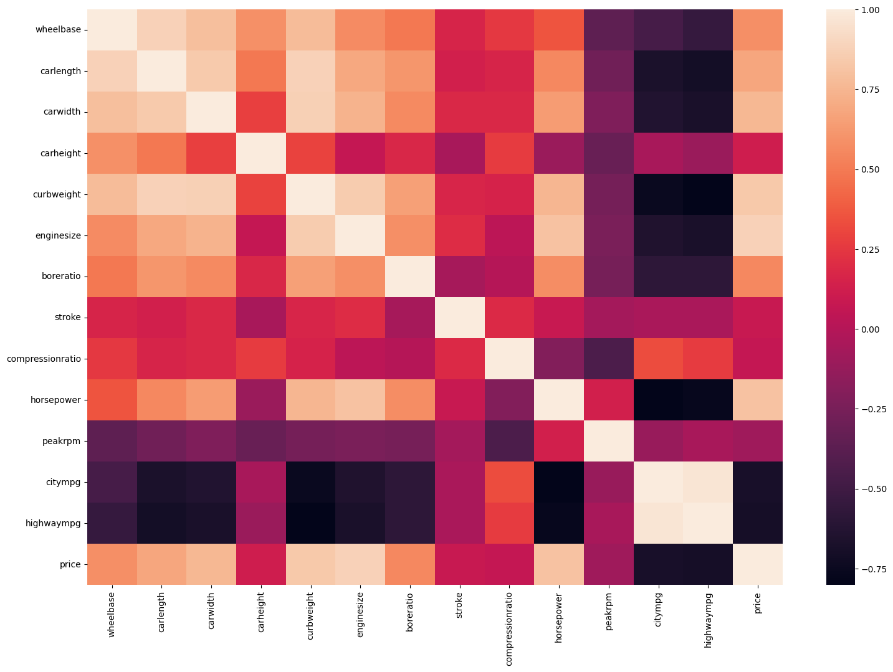
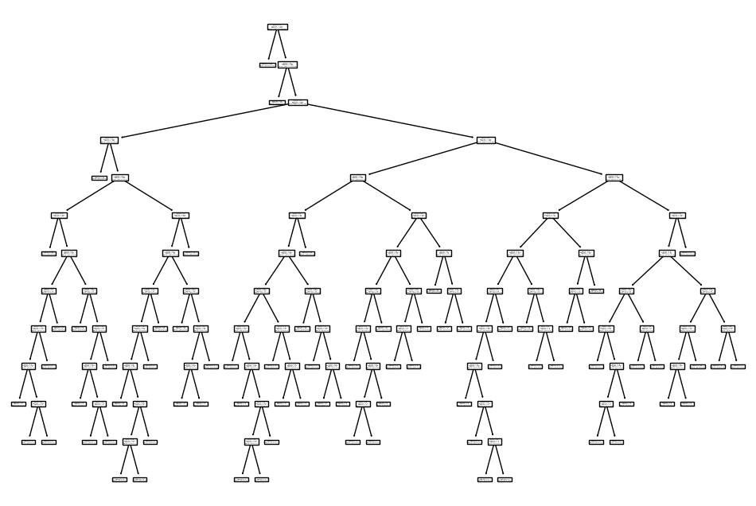
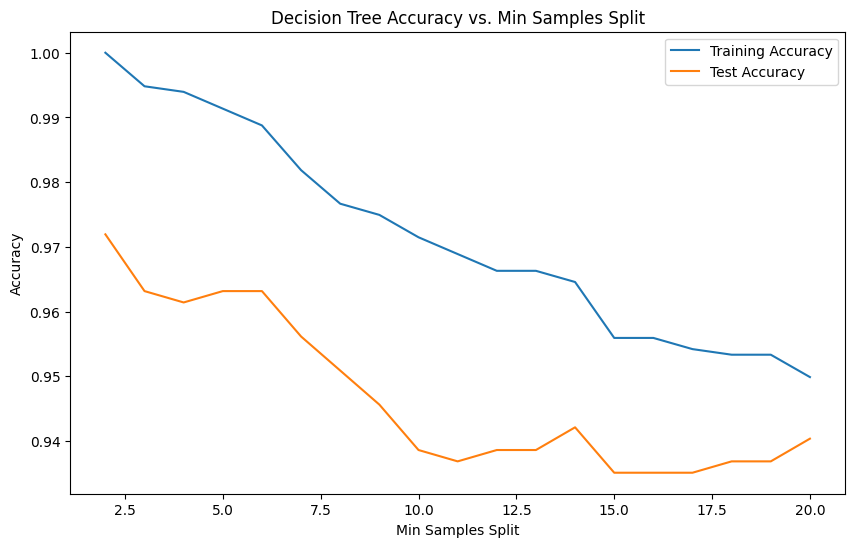
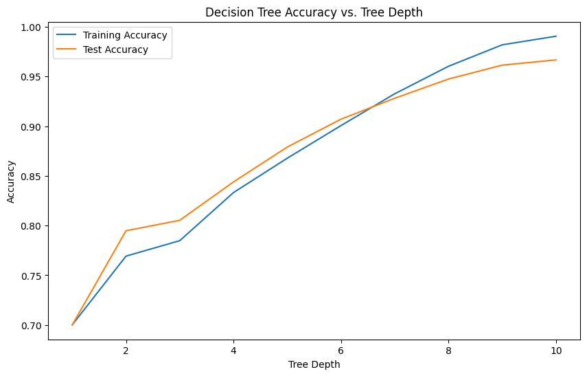

```python
import pandas as pd
import seaborn as sns
from matplotlib import pyplot as plt
df = pd.read_csv('car_dataset.csv')
df.info()
```

    <class 'pandas.core.frame.DataFrame'>
    RangeIndex: 205 entries, 0 to 204
    Data columns (total 26 columns):
     #   Column            Non-Null Count  Dtype  
    ---  ------            --------------  -----  
     0   ID                205 non-null    int64  
     1   symboling         205 non-null    int64  
     2   name              205 non-null    object 
     3   fueltypes         205 non-null    object 
     4   aspiration        205 non-null    object 
     5   doornumbers       205 non-null    object 
     6   carbody           205 non-null    object 
     7   drivewheels       205 non-null    object 
     8   enginelocation    205 non-null    object 
     9   wheelbase         205 non-null    float64
     10  carlength         205 non-null    float64
     11  carwidth          205 non-null    float64
     12  carheight         205 non-null    float64
     13  curbweight        205 non-null    int64  
     14  enginetype        205 non-null    object 
     15  cylindernumber    205 non-null    object 
     16  enginesize        205 non-null    int64  
     17  fuelsystem        205 non-null    object 
     18  boreratio         205 non-null    float64
     19  stroke            205 non-null    float64
     20  compressionratio  205 non-null    float64
     21  horsepower        205 non-null    int64  
     22  peakrpm           205 non-null    int64  
     23  citympg           205 non-null    int64  
     24  highwaympg        205 non-null    int64  
     25  price             205 non-null    float64
    dtypes: float64(8), int64(8), object(10)
    memory usage: 41.8+ KB


```python
numerical_cols = ['wheelbase', 'carlength', 'carwidth', 'carheight', 'curbweight', 'enginesize', 'boreratio', 'stroke', 'compressionratio', 'horsepower', 'peakrpm', 'citympg', 'highwaympg','price']
categorical_cols = ['symboling', 'fueltypes', 'aspiration', 'doornumbers', 'carbody', 'drivewheels', 'enginelocation', 'enginetype', 'cylindernumber', 'fuelsystem']
corr_df=df[numerical_cols].corr()
plt.figure(figsize=(18,12))
sns.heatmap(corr_df)
```


    <Axes: >


    

    


# Data analysis: 
- Price has high correlation with wheelbase, carlength, carwidth, curbweight, enginesize, horsepower as they show the power and weight-class of the car.
- Lower priced cars are usually more economical cars aimed at the common man and these tend to have more fuel-efficiency. Hence price is not that highly correlated with citympg or highwaympg
- Since we will be using a Linear Regression model for this dataset, the correlation between the variables that have high correlation with price is also of much importance as multi-collinearity is a big issue for this type of model

# Data preparation


```python
X = df.loc[:, ['symboling', 'fueltypes', 'aspiration', 'doornumbers','carbody', 'drivewheels', 'enginelocation', 'wheelbase', 'carlength','carwidth', 'carheight', 'curbweight', 'enginetype', 'cylindernumber','enginesize', 'fuelsystem', 'boreratio', 'stroke', 'compressionratio','horsepower', 'peakrpm', 'citympg', 'highwaympg',
'name']]
y = df['price']
```


```python
df_objs = X.select_dtypes(include=['object'])
df_final = pd.get_dummies(df_objs, drop_first=True)
X = X.drop(list(df_objs.columns), axis=1)
X = pd.concat([X, df_final], axis=1)
```


```python
from sklearn.preprocessing import StandardScaler
scaler = StandardScaler()
X_scaled = scaler.fit_transform(X)
y_scaled = scaler.fit_transform([y])
```


```python
from sklearn.model_selection import train_test_split
X_train, X_test, y_train, y_test = train_test_split(X_scaled, y_scaled[0], test_size = 0.3, random_state=42)
```


```python
from sklearn.linear_model import LinearRegression
lr = LinearRegression()
lr.fit(X_train, y_train)
pred = lr.predict(X_test)
from sklearn.metrics import r2_score
r2_score(y_true=y_test, y_pred=pred)
```


    1.0


This R2 score considers all the possible features of the dataset before prediction. It is negative due to the influence of too many feature variables that may not be a key feature in price of the car itself. Since there is no biasing constants the model does not fit to the given data properly.

## Finding the best number of features to build our model with:


```python
from sklearn.decomposition import PCA
x_pca=PCA(n_components=6)
df_pca=x_pca.fit_transform(X_train)
df_pca_test=x_pca.fit_transform(X_test)
```


```python
lr = LinearRegression()
lr.fit(df_pca, y_train)
y_pred = lr.predict(df_pca_test)
from sklearn.metrics import r2_score
r2_score(y_true=y_test, y_pred=y_pred)
```


    1.0


# After some trial and error with Principal component analysis 6 components is optimal for building our model as it has independent variables with high multi-collinearity as we found in the heat map creaeted at  the starting.

# Car Evaluation with Decision tree

## Import data and libraries


```python
from sklearn.tree import DecisionTreeClassifier
from sklearn import datasets
from sklearn.model_selection import train_test_split
from sklearn.metrics import accuracy_score
import pandas as pd
import category_encoders as ce
from sklearn.metrics import accuracy_score
from matplotlib import pyplot as plt
import numpy as np
csv_file_path = 'car_evaluation.csv'
df = pd.read_csv(csv_file_path)
```

## Process data


```python
col_names = ['buying', 'maint', 'doors', 'persons', 'lug_boot', 'safety', 'class']
df.columns = col_names
X = df.drop(['class'], axis=1)
y = df['class']
```

## Split data


```python
X_train,X_test,y_train,y_test=train_test_split(X,y,test_size=0.33, random_state=42)
```

## Encoding


```python
import category_encoders as ce
encoder = ce.OrdinalEncoder(cols=['buying', 'maint', 'doors', 'persons', 'lug_boot', 'safety'])
X_train = encoder.fit_transform(X_train)
X_test = encoder.transform(X_test)
```

## Create model, fit model, predict model(also plot model because it is a Decision Tree)


```python
clf = DecisionTreeClassifier(criterion="entropy")
clf.fit(X_train, y_train)
# Make predictions on the testing set
y_pred = clf.predict(X_test)
plt.figure(figsize=(12,8))
from sklearn import tree
tree.plot_tree(clf.fit(X_train, y_train))
```


    [Text(0.3638698630136986, 0.9615384615384616, 'x[5] <= 1.5\nentropy = 1.206\nsamples = 1157\nvalue = [257, 51, 810, 39]'),
     Text(0.3501712328767123, 0.8846153846153846, 'entropy = 0.0\nsamples = 391\nvalue = [0, 0, 391, 0]'),
     Text(0.3775684931506849, 0.8846153846153846, 'x[3] <= 1.5\nentropy = 1.484\nsamples = 766\nvalue = [257, 51, 419, 39]'),
     Text(0.3638698630136986, 0.8076923076923077, 'entropy = 0.0\nsamples = 242\nvalue = [0, 0, 242, 0]'),
     Text(0.3912671232876712, 0.8076923076923077, 'x[0] <= 2.5\nentropy = 1.639\nsamples = 524\nvalue = [257, 51, 177, 39]'),
     Text(0.136986301369863, 0.7307692307692307, 'x[1] <= 1.5\nentropy = 0.997\nsamples = 266\nvalue = [124, 0, 142, 0]'),
     Text(0.1232876712328767, 0.6538461538461539, 'entropy = 0.0\nsamples = 66\nvalue = [0, 0, 66, 0]'),
     Text(0.1506849315068493, 0.6538461538461539, 'x[1] <= 2.5\nentropy = 0.958\nsamples = 200\nvalue = [124, 0, 76, 0]'),
     Text(0.0684931506849315, 0.5769230769230769, 'x[0] <= 1.5\nentropy = 0.918\nsamples = 63\nvalue = [21, 0, 42, 0]'),
     Text(0.0547945205479452, 0.5, 'entropy = 0.0\nsamples = 34\nvalue = [0, 0, 34, 0]'),
     Text(0.0821917808219178, 0.5, 'x[5] <= 2.5\nentropy = 0.85\nsamples = 29\nvalue = [21, 0, 8, 0]'),
     Text(0.0547945205479452, 0.4230769230769231, 'x[4] <= 2.5\nentropy = 1.0\nsamples = 14\nvalue = [7, 0, 7, 0]'),
     Text(0.0410958904109589, 0.34615384615384615, 'x[4] <= 1.5\nentropy = 0.946\nsamples = 11\nvalue = [4, 0, 7, 0]'),
     Text(0.0273972602739726, 0.2692307692307692, 'x[2] <= 1.5\nentropy = 0.722\nsamples = 5\nvalue = [4, 0, 1, 0]'),
     Text(0.0136986301369863, 0.19230769230769232, 'entropy = 0.0\nsamples = 2\nvalue = [2, 0, 0, 0]'),
     Text(0.0410958904109589, 0.19230769230769232, 'x[2] <= 2.5\nentropy = 0.918\nsamples = 3\nvalue = [2, 0, 1, 0]'),
     Text(0.0273972602739726, 0.11538461538461539, 'entropy = 0.0\nsamples = 1\nvalue = [0, 0, 1, 0]'),
     Text(0.0547945205479452, 0.11538461538461539, 'entropy = 0.0\nsamples = 2\nvalue = [2, 0, 0, 0]'),
     Text(0.0547945205479452, 0.2692307692307692, 'entropy = 0.0\nsamples = 6\nvalue = [0, 0, 6, 0]'),
     Text(0.0684931506849315, 0.34615384615384615, 'entropy = 0.0\nsamples = 3\nvalue = [3, 0, 0, 0]'),
     Text(0.1095890410958904, 0.4230769230769231, 'x[2] <= 3.5\nentropy = 0.353\nsamples = 15\nvalue = [14, 0, 1, 0]'),
     Text(0.0958904109589041, 0.34615384615384615, 'entropy = 0.0\nsamples = 9\nvalue = [9, 0, 0, 0]'),
     Text(0.1232876712328767, 0.34615384615384615, 'x[3] <= 2.5\nentropy = 0.65\nsamples = 6\nvalue = [5, 0, 1, 0]'),
     Text(0.1095890410958904, 0.2692307692307692, 'x[4] <= 1.5\nentropy = 0.918\nsamples = 3\nvalue = [2, 0, 1, 0]'),
     Text(0.0958904109589041, 0.19230769230769232, 'entropy = 0.0\nsamples = 1\nvalue = [1, 0, 0, 0]'),
     Text(0.1232876712328767, 0.19230769230769232, 'x[4] <= 2.5\nentropy = 1.0\nsamples = 2\nvalue = [1, 0, 1, 0]'),
     Text(0.1095890410958904, 0.11538461538461539, 'entropy = 0.0\nsamples = 1\nvalue = [0, 0, 1, 0]'),
     Text(0.136986301369863, 0.11538461538461539, 'entropy = 0.0\nsamples = 1\nvalue = [1, 0, 0, 0]'),
     Text(0.136986301369863, 0.2692307692307692, 'entropy = 0.0\nsamples = 3\nvalue = [3, 0, 0, 0]'),
     Text(0.2328767123287671, 0.5769230769230769, 'x[4] <= 2.5\nentropy = 0.808\nsamples = 137\nvalue = [103, 0, 34, 0]'),
     Text(0.2191780821917808, 0.5, 'x[5] <= 2.5\nentropy = 0.95\nsamples = 92\nvalue = [58, 0, 34, 0]'),
     Text(0.1917808219178082, 0.4230769230769231, 'x[4] <= 1.5\nentropy = 0.944\nsamples = 47\nvalue = [17, 0, 30, 0]'),
     Text(0.1780821917808219, 0.34615384615384615, 'x[2] <= 3.5\nentropy = 0.904\nsamples = 25\nvalue = [17, 0, 8, 0]'),
     Text(0.1643835616438356, 0.2692307692307692, 'x[3] <= 2.5\nentropy = 0.61\nsamples = 20\nvalue = [17, 0, 3, 0]'),
     Text(0.1506849315068493, 0.19230769230769232, 'entropy = 0.0\nsamples = 11\nvalue = [11, 0, 0, 0]'),
     Text(0.1780821917808219, 0.19230769230769232, 'x[2] <= 2.5\nentropy = 0.918\nsamples = 9\nvalue = [6, 0, 3, 0]'),
     Text(0.1643835616438356, 0.11538461538461539, 'x[2] <= 1.5\nentropy = 0.971\nsamples = 5\nvalue = [2, 0, 3, 0]'),
     Text(0.1506849315068493, 0.038461538461538464, 'entropy = 0.0\nsamples = 2\nvalue = [2, 0, 0, 0]'),
     Text(0.1780821917808219, 0.038461538461538464, 'entropy = 0.0\nsamples = 3\nvalue = [0, 0, 3, 0]'),
     Text(0.1917808219178082, 0.11538461538461539, 'entropy = 0.0\nsamples = 4\nvalue = [4, 0, 0, 0]'),
     Text(0.1917808219178082, 0.2692307692307692, 'entropy = 0.0\nsamples = 5\nvalue = [0, 0, 5, 0]'),
     Text(0.2054794520547945, 0.34615384615384615, 'entropy = 0.0\nsamples = 22\nvalue = [0, 0, 22, 0]'),
     Text(0.2465753424657534, 0.4230769230769231, 'x[2] <= 3.5\nentropy = 0.433\nsamples = 45\nvalue = [41, 0, 4, 0]'),
     Text(0.2328767123287671, 0.34615384615384615, 'entropy = 0.0\nsamples = 32\nvalue = [32, 0, 0, 0]'),
     Text(0.2602739726027397, 0.34615384615384615, 'x[3] <= 2.5\nentropy = 0.89\nsamples = 13\nvalue = [9, 0, 4, 0]'),
     Text(0.2465753424657534, 0.2692307692307692, 'x[4] <= 1.5\nentropy = 0.918\nsamples = 6\nvalue = [2, 0, 4, 0]'),
     Text(0.2328767123287671, 0.19230769230769232, 'entropy = 0.0\nsamples = 2\nvalue = [2, 0, 0, 0]'),
     Text(0.2602739726027397, 0.19230769230769232, 'entropy = 0.0\nsamples = 4\nvalue = [0, 0, 4, 0]'),
     Text(0.273972602739726, 0.2692307692307692, 'entropy = 0.0\nsamples = 7\nvalue = [7, 0, 0, 0]'),
     Text(0.2465753424657534, 0.5, 'entropy = 0.0\nsamples = 45\nvalue = [45, 0, 0, 0]'),
     Text(0.6455479452054794, 0.7307692307692307, 'x[1] <= 2.5\nentropy = 1.758\nsamples = 258\nvalue = [133, 51, 35, 39]'),
     Text(0.4726027397260274, 0.6538461538461539, 'x[5] <= 2.5\nentropy = 1.058\nsamples = 125\nvalue = [90, 0, 28, 7]'),
     Text(0.3904109589041096, 0.5769230769230769, 'x[4] <= 2.5\nentropy = 0.98\nsamples = 60\nvalue = [35, 0, 25, 0]'),
     Text(0.3767123287671233, 0.5, 'x[4] <= 1.5\nentropy = 0.987\nsamples = 44\nvalue = [19, 0, 25, 0]'),
     Text(0.3424657534246575, 0.4230769230769231, 'x[2] <= 3.5\nentropy = 0.887\nsamples = 23\nvalue = [16, 0, 7, 0]'),
     Text(0.3150684931506849, 0.34615384615384615, 'x[3] <= 2.5\nentropy = 0.523\nsamples = 17\nvalue = [15, 0, 2, 0]'),
     Text(0.3013698630136986, 0.2692307692307692, 'entropy = 0.0\nsamples = 9\nvalue = [9, 0, 0, 0]'),
     Text(0.3287671232876712, 0.2692307692307692, 'x[2] <= 1.5\nentropy = 0.811\nsamples = 8\nvalue = [6, 0, 2, 0]'),
     Text(0.3150684931506849, 0.19230769230769232, 'entropy = 0.0\nsamples = 3\nvalue = [3, 0, 0, 0]'),
     Text(0.3424657534246575, 0.19230769230769232, 'x[2] <= 2.5\nentropy = 0.971\nsamples = 5\nvalue = [3, 0, 2, 0]'),
     Text(0.3287671232876712, 0.11538461538461539, 'x[0] <= 3.5\nentropy = 0.918\nsamples = 3\nvalue = [1, 0, 2, 0]'),
     Text(0.3150684931506849, 0.038461538461538464, 'entropy = 0.0\nsamples = 2\nvalue = [0, 0, 2, 0]'),
     Text(0.3424657534246575, 0.038461538461538464, 'entropy = 0.0\nsamples = 1\nvalue = [1, 0, 0, 0]'),
     Text(0.3561643835616438, 0.11538461538461539, 'entropy = 0.0\nsamples = 2\nvalue = [2, 0, 0, 0]'),
     Text(0.3698630136986301, 0.34615384615384615, 'x[1] <= 1.5\nentropy = 0.65\nsamples = 6\nvalue = [1, 0, 5, 0]'),
     Text(0.3561643835616438, 0.2692307692307692, 'entropy = 0.0\nsamples = 4\nvalue = [0, 0, 4, 0]'),
     Text(0.3835616438356164, 0.2692307692307692, 'x[0] <= 3.5\nentropy = 1.0\nsamples = 2\nvalue = [1, 0, 1, 0]'),
     Text(0.3698630136986301, 0.19230769230769232, 'entropy = 0.0\nsamples = 1\nvalue = [0, 0, 1, 0]'),
     Text(0.3972602739726027, 0.19230769230769232, 'entropy = 0.0\nsamples = 1\nvalue = [1, 0, 0, 0]'),
     Text(0.410958904109589, 0.4230769230769231, 'x[0] <= 3.5\nentropy = 0.592\nsamples = 21\nvalue = [3, 0, 18, 0]'),
     Text(0.3972602739726027, 0.34615384615384615, 'entropy = 0.0\nsamples = 13\nvalue = [0, 0, 13, 0]'),
     Text(0.4246575342465753, 0.34615384615384615, 'x[1] <= 1.5\nentropy = 0.954\nsamples = 8\nvalue = [3, 0, 5, 0]'),
     Text(0.410958904109589, 0.2692307692307692, 'entropy = 0.0\nsamples = 4\nvalue = [0, 0, 4, 0]'),
     Text(0.4383561643835616, 0.2692307692307692, 'x[3] <= 2.5\nentropy = 0.811\nsamples = 4\nvalue = [3, 0, 1, 0]'),
     Text(0.4246575342465753, 0.19230769230769232, 'entropy = 0.0\nsamples = 1\nvalue = [0, 0, 1, 0]'),
     Text(0.4520547945205479, 0.19230769230769232, 'entropy = 0.0\nsamples = 3\nvalue = [3, 0, 0, 0]'),
     Text(0.4041095890410959, 0.5, 'entropy = 0.0\nsamples = 16\nvalue = [16, 0, 0, 0]'),
     Text(0.5547945205479452, 0.5769230769230769, 'x[4] <= 2.5\nentropy = 0.755\nsamples = 65\nvalue = [55, 0, 3, 7]'),
     Text(0.5205479452054794, 0.5, 'x[2] <= 3.5\nentropy = 0.497\nsamples = 46\nvalue = [42, 0, 3, 1]'),
     Text(0.4931506849315068, 0.4230769230769231, 'x[2] <= 1.5\nentropy = 0.196\nsamples = 33\nvalue = [32, 0, 0, 1]'),
     Text(0.4794520547945205, 0.34615384615384615, 'x[1] <= 1.5\nentropy = 0.414\nsamples = 12\nvalue = [11, 0, 0, 1]'),
     Text(0.4657534246575342, 0.2692307692307692, 'entropy = 0.0\nsamples = 6\nvalue = [6, 0, 0, 0]'),
     Text(0.4931506849315068, 0.2692307692307692, 'x[4] <= 1.5\nentropy = 0.65\nsamples = 6\nvalue = [5, 0, 0, 1]'),
     Text(0.4794520547945205, 0.19230769230769232, 'x[0] <= 3.5\nentropy = 1.0\nsamples = 2\nvalue = [1, 0, 0, 1]'),
     Text(0.4657534246575342, 0.11538461538461539, 'entropy = 0.0\nsamples = 1\nvalue = [1, 0, 0, 0]'),
     Text(0.4931506849315068, 0.11538461538461539, 'entropy = 0.0\nsamples = 1\nvalue = [0, 0, 0, 1]'),
     Text(0.5068493150684932, 0.19230769230769232, 'entropy = 0.0\nsamples = 4\nvalue = [4, 0, 0, 0]'),
     Text(0.5068493150684932, 0.34615384615384615, 'entropy = 0.0\nsamples = 21\nvalue = [21, 0, 0, 0]'),
     Text(0.547945205479452, 0.4230769230769231, 'x[3] <= 2.5\nentropy = 0.779\nsamples = 13\nvalue = [10, 0, 3, 0]'),
     Text(0.5342465753424658, 0.34615384615384615, 'x[4] <= 1.5\nentropy = 1.0\nsamples = 6\nvalue = [3, 0, 3, 0]'),
     Text(0.5205479452054794, 0.2692307692307692, 'entropy = 0.0\nsamples = 3\nvalue = [3, 0, 0, 0]'),
     Text(0.547945205479452, 0.2692307692307692, 'entropy = 0.0\nsamples = 3\nvalue = [0, 0, 3, 0]'),
     Text(0.5616438356164384, 0.34615384615384615, 'entropy = 0.0\nsamples = 7\nvalue = [7, 0, 0, 0]'),
     Text(0.589041095890411, 0.5, 'x[0] <= 3.5\nentropy = 0.9\nsamples = 19\nvalue = [13, 0, 0, 6]'),
     Text(0.5753424657534246, 0.4230769230769231, 'entropy = 0.0\nsamples = 10\nvalue = [10, 0, 0, 0]'),
     Text(0.6027397260273972, 0.4230769230769231, 'x[1] <= 1.5\nentropy = 0.918\nsamples = 9\nvalue = [3, 0, 0, 6]'),
     Text(0.589041095890411, 0.34615384615384615, 'entropy = 0.0\nsamples = 3\nvalue = [3, 0, 0, 0]'),
     Text(0.6164383561643836, 0.34615384615384615, 'entropy = 0.0\nsamples = 6\nvalue = [0, 0, 0, 6]'),
     Text(0.8184931506849316, 0.6538461538461539, 'x[5] <= 2.5\nentropy = 1.775\nsamples = 133\nvalue = [43, 51, 7, 32]'),
     Text(0.7328767123287672, 0.5769230769230769, 'x[4] <= 2.5\nentropy = 1.201\nsamples = 73\nvalue = [38, 32, 3, 0]'),
     Text(0.684931506849315, 0.5, 'x[4] <= 1.5\nentropy = 1.106\nsamples = 44\nvalue = [31, 10, 3, 0]'),
     Text(0.6575342465753424, 0.4230769230769231, 'x[2] <= 3.5\nentropy = 1.0\nsamples = 20\nvalue = [10, 10, 0, 0]'),
     Text(0.6438356164383562, 0.34615384615384615, 'x[0] <= 3.5\nentropy = 0.954\nsamples = 16\nvalue = [6, 10, 0, 0]'),
     Text(0.6301369863013698, 0.2692307692307692, 'x[1] <= 3.5\nentropy = 0.971\nsamples = 10\nvalue = [6, 4, 0, 0]'),
     Text(0.6164383561643836, 0.19230769230769232, 'entropy = 0.0\nsamples = 5\nvalue = [5, 0, 0, 0]'),
     Text(0.6438356164383562, 0.19230769230769232, 'x[3] <= 2.5\nentropy = 0.722\nsamples = 5\nvalue = [1, 4, 0, 0]'),
     Text(0.6301369863013698, 0.11538461538461539, 'entropy = 0.0\nsamples = 3\nvalue = [0, 3, 0, 0]'),
     Text(0.6575342465753424, 0.11538461538461539, 'x[2] <= 2.5\nentropy = 1.0\nsamples = 2\nvalue = [1, 1, 0, 0]'),
     Text(0.6438356164383562, 0.038461538461538464, 'entropy = 0.0\nsamples = 1\nvalue = [1, 0, 0, 0]'),
     Text(0.6712328767123288, 0.038461538461538464, 'entropy = 0.0\nsamples = 1\nvalue = [0, 1, 0, 0]'),
     Text(0.6575342465753424, 0.2692307692307692, 'entropy = 0.0\nsamples = 6\nvalue = [0, 6, 0, 0]'),
     Text(0.6712328767123288, 0.34615384615384615, 'entropy = 0.0\nsamples = 4\nvalue = [4, 0, 0, 0]'),
     Text(0.7123287671232876, 0.4230769230769231, 'x[2] <= 3.5\nentropy = 0.544\nsamples = 24\nvalue = [21, 0, 3, 0]'),
     Text(0.6986301369863014, 0.34615384615384615, 'entropy = 0.0\nsamples = 18\nvalue = [18, 0, 0, 0]'),
     Text(0.726027397260274, 0.34615384615384615, 'x[3] <= 2.5\nentropy = 1.0\nsamples = 6\nvalue = [3, 0, 3, 0]'),
     Text(0.7123287671232876, 0.2692307692307692, 'entropy = 0.0\nsamples = 3\nvalue = [0, 0, 3, 0]'),
     Text(0.7397260273972602, 0.2692307692307692, 'entropy = 0.0\nsamples = 3\nvalue = [3, 0, 0, 0]'),
     Text(0.7808219178082192, 0.5, 'x[1] <= 3.5\nentropy = 0.797\nsamples = 29\nvalue = [7, 22, 0, 0]'),
     Text(0.7671232876712328, 0.4230769230769231, 'x[0] <= 3.5\nentropy = 1.0\nsamples = 14\nvalue = [7, 7, 0, 0]'),
     Text(0.7534246575342466, 0.34615384615384615, 'entropy = 0.0\nsamples = 7\nvalue = [7, 0, 0, 0]'),
     Text(0.7808219178082192, 0.34615384615384615, 'entropy = 0.0\nsamples = 7\nvalue = [0, 7, 0, 0]'),
     Text(0.7945205479452054, 0.4230769230769231, 'entropy = 0.0\nsamples = 15\nvalue = [0, 15, 0, 0]'),
     Text(0.9041095890410958, 0.5769230769230769, 'x[4] <= 2.5\nentropy = 1.568\nsamples = 60\nvalue = [5, 19, 4, 32]'),
     Text(0.8904109589041096, 0.5, 'x[4] <= 1.5\nentropy = 1.73\nsamples = 43\nvalue = [5, 19, 4, 15]'),
     Text(0.8356164383561644, 0.4230769230769231, 'x[2] <= 3.5\nentropy = 0.913\nsamples = 19\nvalue = [1, 3, 0, 15]'),
     Text(0.8082191780821918, 0.34615384615384615, 'x[3] <= 2.5\nentropy = 0.523\nsamples = 17\nvalue = [0, 2, 0, 15]'),
     Text(0.7945205479452054, 0.2692307692307692, 'entropy = 0.0\nsamples = 9\nvalue = [0, 0, 0, 9]'),
     Text(0.821917808219178, 0.2692307692307692, 'x[2] <= 2.5\nentropy = 0.811\nsamples = 8\nvalue = [0, 2, 0, 6]'),
     Text(0.8082191780821918, 0.19230769230769232, 'x[2] <= 1.5\nentropy = 1.0\nsamples = 4\nvalue = [0, 2, 0, 2]'),
     Text(0.7945205479452054, 0.11538461538461539, 'entropy = 0.0\nsamples = 2\nvalue = [0, 0, 0, 2]'),
     Text(0.821917808219178, 0.11538461538461539, 'entropy = 0.0\nsamples = 2\nvalue = [0, 2, 0, 0]'),
     Text(0.8356164383561644, 0.19230769230769232, 'entropy = 0.0\nsamples = 4\nvalue = [0, 0, 0, 4]'),
     Text(0.863013698630137, 0.34615384615384615, 'x[1] <= 3.5\nentropy = 1.0\nsamples = 2\nvalue = [1, 1, 0, 0]'),
     Text(0.8493150684931506, 0.2692307692307692, 'entropy = 0.0\nsamples = 1\nvalue = [1, 0, 0, 0]'),
     Text(0.8767123287671232, 0.2692307692307692, 'entropy = 0.0\nsamples = 1\nvalue = [0, 1, 0, 0]'),
     Text(0.9452054794520548, 0.4230769230769231, 'x[2] <= 3.5\nentropy = 1.252\nsamples = 24\nvalue = [4, 16, 4, 0]'),
     Text(0.9178082191780822, 0.34615384615384615, 'x[0] <= 3.5\nentropy = 0.787\nsamples = 17\nvalue = [4, 13, 0, 0]'),
     Text(0.9041095890410958, 0.2692307692307692, 'x[1] <= 3.5\nentropy = 0.985\nsamples = 7\nvalue = [4, 3, 0, 0]'),
     Text(0.8904109589041096, 0.19230769230769232, 'entropy = 0.0\nsamples = 4\nvalue = [4, 0, 0, 0]'),
     Text(0.9178082191780822, 0.19230769230769232, 'entropy = 0.0\nsamples = 3\nvalue = [0, 3, 0, 0]'),
     Text(0.9315068493150684, 0.2692307692307692, 'entropy = 0.0\nsamples = 10\nvalue = [0, 10, 0, 0]'),
     Text(0.9726027397260274, 0.34615384615384615, 'x[3] <= 2.5\nentropy = 0.985\nsamples = 7\nvalue = [0, 3, 4, 0]'),
     Text(0.958904109589041, 0.2692307692307692, 'entropy = 0.0\nsamples = 4\nvalue = [0, 0, 4, 0]'),
     Text(0.9863013698630136, 0.2692307692307692, 'entropy = 0.0\nsamples = 3\nvalue = [0, 3, 0, 0]'),
     Text(0.9178082191780822, 0.5, 'entropy = 0.0\nsamples = 17\nvalue = [0, 0, 0, 17]')]


    

    


## An analysis on accuracy based on tree depth and min samples split by plotting the accuracy against depth and accuracy against min samples split

## Accuracy against min samples split


```python
train_accuracy = []
test_accuracy = []

# Test different values for min_samples_split
min_samples_splits = np.arange(2, 21)
for min_samples_split in min_samples_splits:
    # Create a Decision Tree Classifier with the specified min_samples_split
    clf = DecisionTreeClassifier(criterion="entropy", min_samples_split=min_samples_split)

    # Train the classifier on the training set
    clf.fit(X_train, y_train)

    # Make predictions on the training and testing sets
    y_train_pred = clf.predict(X_train)
    y_test_pred = clf.predict(X_test)

    # Calculate and store accuracy values
    train_accuracy.append(accuracy_score(y_train, y_train_pred))
    test_accuracy.append(accuracy_score(y_test, y_test_pred))

# Plot the accuracy values
plt.figure(figsize=(10, 6))
plt.plot(min_samples_splits, train_accuracy, label="Training Accuracy")
plt.plot(min_samples_splits, test_accuracy, label="Test Accuracy")
plt.xlabel("Min Samples Split")
plt.ylabel("Accuracy")
plt.title("Decision Tree Accuracy vs. Min Samples Split")
plt.legend()
plt.show()
```


    

    


# Impact of `min_samples_split` on Decision Tree Model Accuracy

The `min_samples_split` parameter in a decision tree model determines the minimum number of samples required to split an internal node during the tree-building process. This hyperparameter can significantly impact the accuracy of the model. Here's how:

## Increasing `min_samples_split`

- **Effect:** Enforces a higher threshold for creating new splits in the tree, resulting in fewer and larger nodes.
- **Impact on Accuracy:**
  - *Pros:* Generally leads to a simpler tree structure, less prone to capturing noise in the training data.
  - *Cons:* Might result in underfitting, potentially leading to reduced accuracy on both the training and test datasets.

## Decreasing `min_samples_split`

- **Effect:** Lowers the threshold for splitting, allowing more partitions in the tree and smaller nodes.
- **Impact on Accuracy:**
  - *Pros:* Can capture finer details and complex relationships in the data.
  - *Cons:* Increases the risk of overfitting, where the model fits the training data too closely and may not generalize well to new, unseen data.

In summary, tuning the `min_samples_split` parameter involves finding the right balance. A higher value helps prevent overfitting but may lead to underfitting, while a lower value allows the model to capture more details but may result in overfitting.
In our case it is clear that using less min samples split threshold has lead to an increase in accuracy as each node covers much more cases of the dataset compared to when the threshold is set at a higher value there is a higher error margin.


## Accuracy against depth


```python
train_accuracy = []
test_accuracy = []

# Test different tree depths
depths = np.arange(1, 11)
for depth in depths:
    # Create a Decision Tree Classifier with the specified depth
    clf = DecisionTreeClassifier(criterion="entropy", max_depth=depth)

    # Train the classifier on the training set
    clf.fit(X_train, y_train)

    # Make predictions on the training and testing sets
    y_train_pred = clf.predict(X_train)
    y_test_pred = clf.predict(X_test)

    # Calculate and store accuracy values
    train_accuracy.append(accuracy_score(y_train, y_train_pred))
    test_accuracy.append(accuracy_score(y_test, y_test_pred))

# Plot the accuracy values
plt.figure(figsize=(10, 6))
plt.plot(depths, train_accuracy, label="Training Accuracy")
plt.plot(depths, test_accuracy, label="Test Accuracy")
plt.xlabel("Tree Depth")
plt.ylabel("Accuracy")
plt.title("Decision Tree Accuracy vs. Tree Depth")
plt.legend()
```


    <matplotlib.legend.Legend at 0x7f5238c14100>


    

    


# Impact of Decision Tree Depth on Accuracy

## Increasing Depth

- **Pros:**
  - Captures complex relationships and intricate patterns in the training data.
  
- **Cons:**
  - Higher risk of overfitting, learning noise and outliers.
  - Reduced generalization to new, unseen data.

## Decreasing Depth

- **Pros:**
  - More robust to noise and outliers in the training data.
  - Lower risk of overfitting, better generalization to new data.

- **Cons:**
  - May struggle to capture complex patterns, potential for underfitting.
  - Training set performance may not be as high as with a deeper tree.

Finding the right depth involves a trade-off between capturing patterns and ensuring generalization. Cross-validation helps select an optimal depth that balances bias and variance.
The depth greatly increases the accuracy as it forces the model to cover more complexx relations and patterns present in the data. It covers a wider range of data when the model has a high tree depth which is also seen in our plot above.


```python

```
